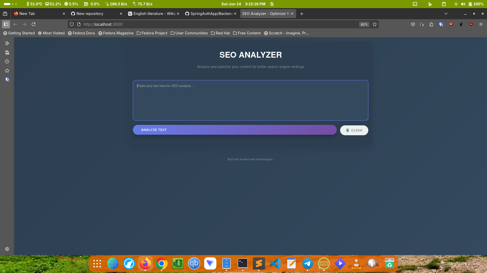
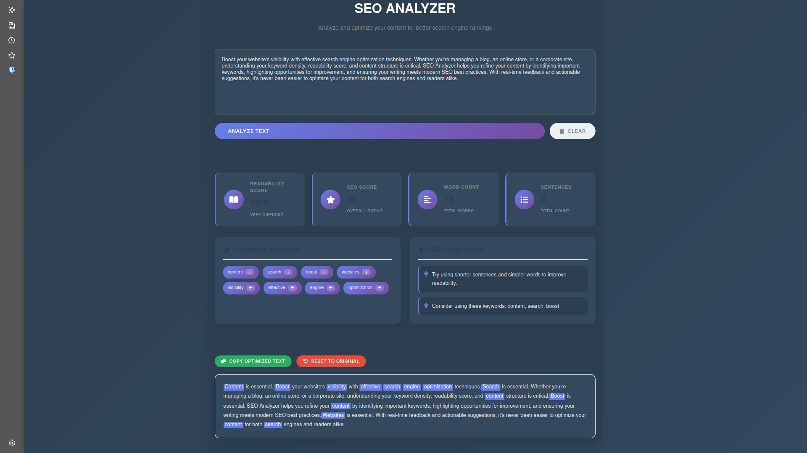

# SEO Analyzer 🚀

A modern, responsive web application that analyzes text content for SEO optimization. Features real-time keyword extraction, readability scoring, and content optimization suggestions.





## ✨ Features

### Core Functionality
- **Smart Text Analysis**: Analyzes content for SEO effectiveness
- **Keyword Extraction**: Identifies important keywords using TextRazor API or local algorithms
- **Readability Scoring**: Calculates Flesch Reading Ease scores
- **Content Optimization**: Provides actionable suggestions for improvement
- **Real-time Preview**: Shows optimized text with highlighted keywords

### Technical Features
- **Dual Analysis Modes**: TextRazor API integration with local fallback
- **Error Handling**: Comprehensive error management and user feedback
- **Performance Optimized**: Efficient text processing and UI updates
- **Security**: Input validation and content length limits
- **Accessibility**: ARIA labels and semantic HTML

## 🛠 Installation

### Prerequisites
- Node.js (v14 or higher)
- npm or yarn package manager

### Quick Start

1. **Clone the repository**
   ```bash
   git clone https://github.com/yourusername/seo-analyzer.git
   cd seo-analyzer
   ```

2. **Install dependencies**
   ```bash
   npm install
   ```

3. **Set up environment variables** (Optional)
   ```bash
   cp .env.example .env
   # Edit .env and add your TextRazor API key
   ```

4. **Start the application**
   ```bash
   npm start
   ```

5. **Open your browser**
   Navigate to `http://localhost:3000`

## ⚙️ Configuration

### Environment Variables

Create a `.env` file in the root directory:

```env
# Server Configuration
PORT=3000

# TextRazor API (Optional - for enhanced keyword extraction)
TEXTRAZOR_API_KEY=your_textrazor_api_key_here
```

### TextRazor API Setup (Optional)

For enhanced keyword extraction:

1. Sign up at [TextRazor](https://www.textrazor.com/)
2. Get your free API key (1,000 requests/month)
3. Add the key to your `.env` file
4. Restart the server

**Note**: The application works perfectly without the API key using local analysis algorithms.

## 🚀 Usage

### Basic Analysis
1. Enter or paste your text content into the textarea
2. Click "Analyze Text" or press Ctrl/Cmd + Enter
3. Review the analysis results:
   - **Readability Score**: Flesch Reading Ease rating
   - **SEO Score**: Overall content optimization rating
   - **Word Count**: Total words and sentences
   - **Keywords**: Extracted relevant keywords
   - **Suggestions**: Actionable improvement recommendations

### Advanced Features
- **Keyword Integration**: Click the "+" button next to keywords to add them to your content
- **Text Optimization**: View and copy the optimized version of your text
- **Reset Functionality**: Restore original text anytime
- **Responsive Feedback**: Real-time notifications for user actions

## 📁 Project Structure

```
seo-analyzer/
├── backend/
│   └── server.js          # Express.js server and API routes
├── frontend/
│   ├── index.html         # Main HTML structure
│   ├── style.css          # Responsive CSS styling
│   └── script.js          # Frontend JavaScript logic
├── package.json           # Dependencies and scripts
├── .gitignore            # Git ignore patterns
├── .env.example          # Environment variables template
└── README.md             # This file
```


### Code Structure

**Backend (`server.js`)**
- Express.js server setup
- TextRazor API integration
- Local text analysis algorithms
- Error handling and validation

**Frontend**
- `index.html`: Semantic HTML structure with accessibility features
- `style.css`: Modern CSS with Grid, Flexbox, and animations
- `script.js`: Vanilla JavaScript with async/await and DOM manipulation

### Key Algorithms

**Readability Calculation**: Flesch Reading Ease formula
```javascript
readability = 206.835 - (1.015 × avgWordsPerSentence) - (84.6 × syllablesPerWord)
```

**Keyword Extraction**: TF-IDF-based approach with stop word filtering

**SEO Scoring**: Multi-factor analysis including word count, keyword density, and content structure

## 🌐 Browser Support

- Chrome/Chromium 60+
- Firefox 55+
- Safari 12+
- Edge 79+
- Mobile browsers (iOS Safari, Chrome Mobile)

## 🎨 Customization

### Styling
Modify `style.css` to customize:
- Color schemes and gradients
- Typography and spacing
- Animation timing and effects
- Responsive breakpoints

### Analysis Parameters
Adjust in `server.js`:
- Readability thresholds
- Keyword extraction limits
- SEO scoring weights
- API timeout settings


## 📄 License

This project is licensed under the MIT License - see the [LICENSE](LICENSE) file for details.

## 🙏 Acknowledgments

- [TextRazor](https://www.textrazor.com/) for advanced NLP capabilities
- [Font Awesome](https://fontawesome.com/) for beautiful icons
- [Express.js](https://expressjs.com/) for the robust backend framework

